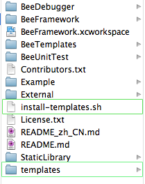

# Beeframework_template_installer 

这是基于老郭的Beeframework做的xcode4的项目模板。

## 准备工作

把install-templates.sh 和 templates目录放到Beeframework目录内

## 安装
在终端中，cd切换到Beeframework目录内，然后执行命令:

	./install-templates.sh -f
	
出现下列文字即安装完成：

	removing old libraries: /Users/sang/Library/Developer/Xcode/Templates/File Templates/beeframework-ios v0.x/
	...creating destination directory: /Users/sang/Library/Developer/Xcode/Templates/File Templates/beeframework-ios v0.x/
	done!

## 说明

目前该模板是基于Beeframework v0.3版本的，所以对之前的版本可能不兼容，待改进。

## 欢迎fork和反馈

shiren1118@126.com
